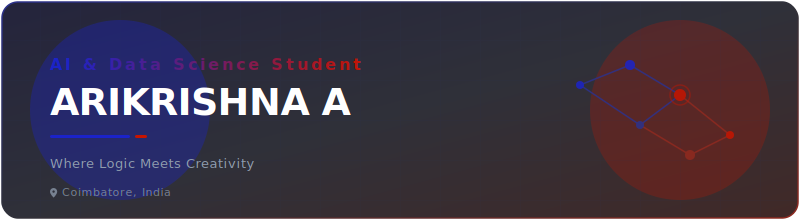

  <!-- Animated Header -->
  

    

  <!-- Typing SVG -->
  

   

  <!-- Professional Action Buttons -->
  
  
  
  

    

  <!-- Profile Stats Badges -->
  
  
  

    
  
   

## 🪐 About Me

I am an **Artificial Intelligence and Data Science** undergraduate student based in Coimbatore, India. I operate at the intersection of mathematical rigor (logic) and creative problem-solving. My core academic and technical focus is developing pipelines that extract actionable patterns from structured and unstructured datasets.

- 🔭 I’m currently developing deep neural network models and optimizing data architectures.
- 📚 Studying advanced Machine Learning, statistical inference, and big data systems.
- ⚡ Fun fact: I believe coding is just another medium for creative expression.

 

  <!-- Minimalist "Open To" Info Box -->
  <table width="100%">
    <tr>
      <td bgcolor="#24243C" style="border: 1px solid #2D305F; border-radius: 12px; padding: 20px;">
        <h3 style="margin-top: 0; color: #C71400; font-family: 'Outfit', sans-serif;">🎓 OPEN TO OPPORTUNITIES</h3>
        

          <strong>Roles:</strong> Data Science Internships, Machine Learning Engineering, Research Fellowships, Software Development 
          <strong>Focus Areas:</strong> Deep Learning, Computer Vision, MLOps, NLP, Predictive Modeling 
          <strong>Location:</strong> Coimbatore, India (Open to Hybrid / Remote)
        

      </td>
    </tr>
  </table>

 

 

## 🛠️ Tech Stack & Skills

<table width="100%">
  <tr>
    <td width="30%" valign="top"><strong>Languages</strong></td>
    <td>
      
      
      
      
      
    </td>
  </tr>
  <tr>
    <td valign="top"><strong>AI & Machine Learning</strong></td>
    <td>
      
      
      
      
      
    </td>
  </tr>
  <tr>
    <td valign="top"><strong>Frontend & Backend</strong></td>
    <td>
      
      
      
      
      
    </td>
  </tr>
  <tr>
    <td valign="top"><strong>Cloud & DevOps</strong></td>
    <td>
      
      
      
      
      
    </td>
  </tr>
  <tr>
    <td valign="top"><strong>Databases & Tools</strong></td>
    <td>
      
      
      
      
      
    </td>
  </tr>
</table>

 

### 🧠 AI & ML Expertise Matrix

| Domain | Core Frameworks | Architectures & Techniques |
| :--- | :--- | :--- |
| **Computer Vision** | OpenCV, PyTorch, TensorFlow | CNNs, Image Segmentation, U-Net, Object Detection (YOLO) |
| **Natural Language Processing** | Hugging Face, NLTK, Transformers | Tokenization, BERT Fine-tuning, Sequence-to-Sequence models |
| **Classical Machine Learning** | Scikit-Learn, XGBoost, Pandas | Random Forests, SVMs, Regression, Clustering Analysis |
| **MLOps & Engineering** | FastAPI, Docker, Git | Model Containerization, Inference APIs, Version Control Pipelines |

 

 

## 🚀 Featured Projects

Here are highlights of my engineering work. Click each card to expand details.

  
<strong>🤖 AI-Driven Sentiment Analysis API</strong>

   
  <blockquote>
    An end-to-end sentiment classification microservice.
  </blockquote>
  
  - Fine-tuned a transformer model on 50k+ social sentiment records.
  - Developed inference APIs with latency under 100ms using **FastAPI**.
  - Packaged the entire pipeline using **Docker** for standardized staging deployments.
  
  `PyTorch` `Hugging Face` `FastAPI` `Docker` `Python`

  
<strong>📊 Interactive Data Analytics Hub</strong>

   
  <blockquote>
    Interactive client-side analytics portal displaying predictive charts.
  </blockquote>
  
  - Designed interactive D3 charts representing real-time telemetry inputs.
  - Implemented responsive design structures for high-performance viewing.
  
  `React` `D3.js` `JavaScript` `CSS3`

  
<strong>🩺 Medical Image Segmentation Pipeline</strong>

   
  <blockquote>
    Clinical scans anomaly detection using deep convolutional networks.
  </blockquote>
  
  - Trained a U-Net architecture for cell boundary and anomaly segmentation in MRI slices.
  - Enhanced classification boundaries using custom weight-map loss functions.
  
  `TensorFlow` `Keras` `OpenCV` `Python`

 

 

## 💼 Experience & Education

### 🎓 Education
- **Bachelor of Technology in Artificial Intelligence & Data Science**
  *Coimbatore, India* • *Ongoing*
  - Key coursework: Statistical Foundations, Data Structures & Algorithms, Neural Networks, Database Systems.

### 💻 Academic Projects & Open Source
- **Student Researcher & ML Developer**
  - Designed and executed deep learning experiments.
  - Collaborated on pipeline optimizations for computer vision research models.

 

 

## 🏆 Achievements & Certifications

- 🥇 Winner / Top Finisher in local collegiate Hackathons.
- 🎓 Deep Learning Specialization – Coursera.
- 🎓 Google Cloud Data Analytics Professional Certificate.

 

 

## 💻 Coding Profiles

  
  
  
  

 

 

## 📊 GitHub Analytics

  <!-- Readme Stats & Top Languages Side by Side (HTML layout) -->
  <table border="0" cellpadding="0" cellspacing="0" width="100%">
    <tr>
      <td width="50%" align="center">
        
      </td>
      <td width="50%" align="center">
        
      </td>
    </tr>
  </table>

   

  <!-- Streak Stats & Activity Graph Side by Side -->
  <table border="0" cellpadding="0" cellspacing="0" width="100%">
    <tr>
      <td width="50%" align="center">
        
      </td>
      <td width="50%" align="center">
        
      </td>
    </tr>
  </table>

   

  <!-- Trophies -->
  <table width="100%">
    <tr>
      <td bgcolor="#24243C" style="border: 1px solid #2D305F; border-radius: 12px; padding: 20px; text-align: center;">
        <h4 style="margin-top: 0; color: #C71400; font-family: 'Outfit', sans-serif; letter-spacing: 1px;">🏆 GITHUB TROPHIES</h4>
         
        
      </td>
    </tr>
  </table>

    

  <!-- Contribution Snake Animation -->
  <h4>🐍 Contribution Snake</h4>
  

 

 

## 🎯 Current Focus

  <table width="100%">
    <tr>
      <td bgcolor="#24243C" style="border: 1px solid #2D305F; border-radius: 12px; padding: 20px; text-align: center;">
        

          
          &nbsp;&nbsp;
          
        

        

          
        

        

          
        

      </td>
    </tr>
  </table>

 

 

## 🤝 Connect With Me

  
  &nbsp;&nbsp;
  
  &nbsp;&nbsp;
  

  

  <!-- Animated Footer -->
  

